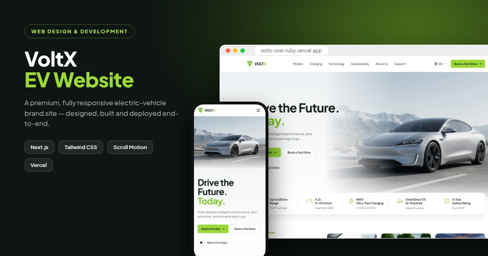

# VoltX — Electric Vehicle Brand Website



**Live site:** https://voltx-one-ruby.vercel.app

VoltX is a concept website for a fictional electric-vehicle brand. It's a premium, fully responsive marketing site built from a design mockup and taken from layout to live deployment.

## Highlights

- **15+ pages:** Home, Models, one page per model (S, X, GT, T), Charging, Technology, Sustainability, About, Support, Test Drive, Contact, Careers, Newsroom and legal pages
- **Video hero** with an animated entrance, scroll parallax and soft-masked edges
- **Scroll motion:** staggered reveal-on-scroll, image zoom-ins, count-up stats, Ken Burns banners and a scroll progress bar (turned off for users who prefer reduced motion)
- **Interactive features:**
  - a model configurator with trim and paint choices and a live price
  - a model comparison table
  - a charging station finder
  - a fuel savings calculator
  - a testimonial carousel, FAQ accordion, and booking and contact forms
- **Responsive** from 320 px phones to wide desktops, with no horizontal scroll
- **Fast:** pages are pre-rendered as static HTML, images are optimised with `next/image`, and fonts are self-hosted

## Tech stack

- [Next.js 16](https://nextjs.org) (App Router) + React 19 + TypeScript
- [Tailwind CSS 4](https://tailwindcss.com)
- [Lucide](https://lucide.dev) icons
- Deployed on [Vercel](https://vercel.com)

## Run locally

```bash
npm install
npm run dev     # http://localhost:3000
npm run build   # production build
```

## Project structure

```
app/          routes (one folder per page)
components/   UI building blocks (Hero, ModelCard, Configurator, ScrollMotion…)
lib/data.ts   models, navigation, testimonials: edit content here
public/images photos and hero video
```

---

*VoltX is a fictional brand created for portfolio purposes. Vehicle photography is used for demonstration only.*
